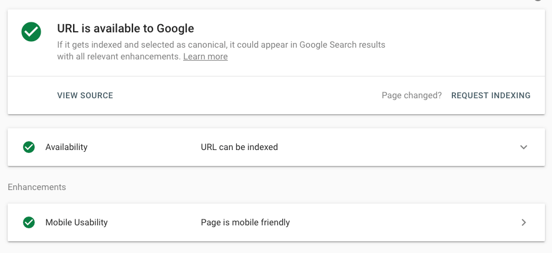
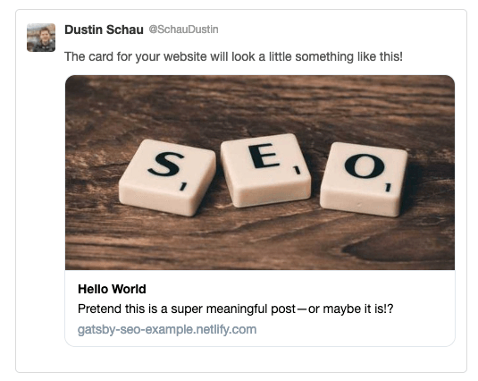
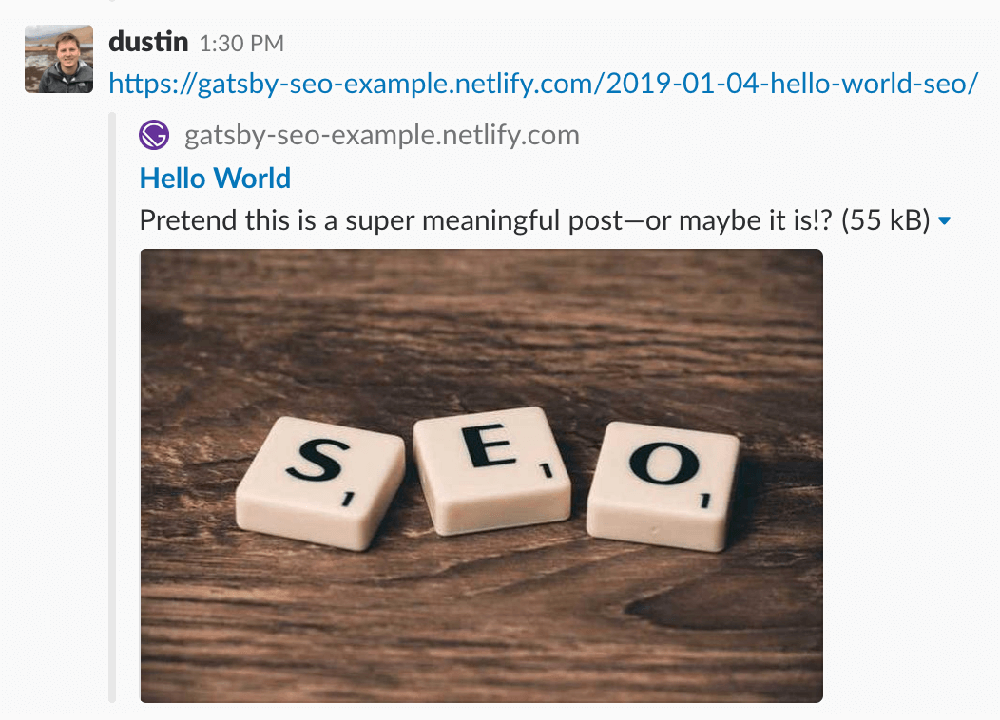

Search Engine Optimization (hereafter SEO) is something that you should want. You've possibly even been approached by an SEO _expert_ who can maximize your revenue and page views just by following these **Three Simple Tricks**! However, relatively few make the concerted effort to implement SEO in their web app. In this post, I'll share some of the ins and outs of SEO and how you can implement common, simple SEO patterns in your Gatsby web app, today. By the end of this post you'll know how to do the following:

- Implement SEO patterns with [react-helmet][react-helmet]
- Create an optimized social sharing card for Twitter, Facebook, and Slack
- Tweak the SEO component exposed in the default gatsby starter ([`gatsby-starter-default`][gatsby-starter-default])

## Implementation

The core technology powering SEO is the humble, ubiquitiuous `meta` tag. You've probably seen something like:

```html
<meta
  name="viewport"
  content="width=device-width, initial-scale=1, shrink-to-fit=no"
/>
```

or further still with more of an SEO spin something as simple as the `description` and/or `keywords` properties:

```html
<meta
  name="description"
  content="This is probably some earth-shattering excerpt that is around ~200 characters or less"
/>
<meta
  name="keywords"
  content="science dog, another term, do-i-use-spaces, hello"
/>
```

These are the _bare minimum_ requirements that should be implemented for simple and basic SEO. However--we can go further, and we can go further with the powerful combo of content rendered at _build time_ powered by Gatsby and GraphQL. Let's dive in.

## Gatsby + GraphQL

GraphQL is a crucial feature enabled via Gatsby (note: you don't [_have_ to use GraphQL with Gatsby][unstructured-data]). Leveraging GraphQL to query your indexable content--wherever it lives (at build time!)--is one of the most powerful and flexible techniques enabled via Gatsby. Let's briefly look at how we can implement an extensible and flexible SEO component.

### `StaticQuery`

Gatsby distinguishes between page-level queries and component queries. The former can use page GraphQL queries while the latter can use a new in Gatsby v2 feature called [`StaticQuery`][gatsby-static-query]. A StaticQuery will be parsed, evaluated, and injected at _build time_ into the component that is requesting the data. This is a perfect scenario in which we can create an SEO component with sane defaults that can be easily extended.

### Creating the component

Using the power and flexibility of React, we can create a React component to power this functionality.

> Note: `react-helmet` is enabled, by default, in gatsby-starter-default and gatsby-starter-blog
>
> If you're not using those: [follow this guide for installation instructions][gatsby-plugin-react-helmet]

```jsx:title=src/components/seo.js
import React from 'react';
// highlight-start
import Helmet from 'react-helmet';
import { useStaticQuery, graphql } from 'gatsby';
// highlight-end

function SEO() {
  const data = useStaticQuery(graphql`
    # highlight-start
    {
      site {
        siteMetadata {
          description
          keywords
          siteUrl
        }
      }
    }
    # highlight-end
  `);
  return null; /* TO IMPLEMENT, of course! */
}

export default SEO;
```

This component doesn't _do_ anything yet, but we're laying the foundation for a useful, extensible component. What we've done up to this point is leverage the `StaticQuery` functionality enabled via Gatsby to query our siteMetadata (e.g. details in `gatsby-config.js`) so that we can grab description and keywords.

The `StaticQuery` component accepts a render prop, and at this point, we're simply returning `null` to render nothing. Let's _actually_ render something and build out our prototype for this SEO component. Let's iterate further.

```jsx:title=src/components/seo.js
import React from 'react';
import Helmet from 'react-helmet';
import { useStaticQuery, graphql } from 'gatsby';

function SEO() {
  const data = useStaticQuery(graphql`
    {
      site {
        siteMetadata {
          description
          keywords
          siteUrl
        }
      }
    }
  `);

  return (
    <Helmet
      htmlAttributes={{
        lang: 'en',
      }}
      meta={
        // highlight-start
        [
          {
            name: 'description',
            content: data.site.siteMetadata.description,
          },
        ]
        // highlight-end
      }
    />
  );
}

export default SEO;
```

whew, getting closer! This will now render the `meta` `description` tag, and will do so using content injected at build-time with the `StaticQuery` component. Additionally, it will add the `lang="en"` attribute to our root-level `html` tag to silence that pesky Lighthouse warning 😉

If you remember earlier, I claimed this was the bare bones, rudimentary approach to SEO, and that still holds true. Let's enhance this functionality this and get some useful functionality for sharing a page via social networks like Facebook, Twitter, and Slack.

### Implementing social SEO

In addition to SEO for actual _search_ engines we also want those pretty cards that social networks like Twitter and Slack enable. Specifically, we'd like to implement the following:

- Description for embedded results
- Title for embedded results
- (Optionally) display an image and a card if an image is passed in to the component

Let's implement it 👌

```jsx:title=src/components/seo.js
import React from 'react';
import Helmet from 'react-helmet';
import PropTypes from 'prop-types'; // highlight-line
import { StaticQuery, graphql } from 'gatsby';

// highlight-next-line
function SEO({ description, meta, image: metaImage, title }) {
  return (
    <StaticQuery
      query={graphql`
        {
          site {
            siteMetadata {
              author
              description
              siteUrl
              keywords
            }
          }
        }
      `}
      render={(data) => {
        // highlight-start
        const metaDescription =
          description || data.site.siteMetadata.description;
        const image =
          metaImage && metaImage.src
            ? `${data.site.siteMetadata.siteUrl}${metaImage.src}`
            : null;
        // highlight-end
        return (
          <Helmet
            htmlAttributes={{
              lang: 'en',
            }}
            title={title}
            meta={
              [
                {
                  name: 'description',
                  content: metaDescription,
                },
                {
                  name: 'keywords',
                  content: data.site.siteMetadata.keywords.join(','),
                },
                // highlight-start
                {
                  property: 'og:title',
                  content: title,
                },
                {
                  property: 'og:description',
                  content: metaDescription,
                },
                {
                  name: 'twitter:creator',
                  content: data.site.siteMetadata.author,
                },
                {
                  name: 'twitter:title',
                  content: title,
                },
                {
                  name: 'twitter:description',
                  content: metaDescription,
                },
              ]
                .concat(
                  metaImage
                    ? [
                        {
                          property: 'og:image',
                          content: image,
                        },
                        {
                          property: 'og:image:width',
                          content: metaImage.width,
                        },
                        {
                          property: 'og:image:height',
                          content: metaImage.height,
                        },
                        {
                          name: 'twitter:card',
                          content: 'summary_large_image',
                        },
                      ]
                    : [
                        {
                          name: 'twitter:card',
                          content: 'summary',
                        },
                      ]
                )
                .concat(meta)
              // highlight-end
            }
          />
        );
      }}
    />
  );
}

// highlight-start
SEO.defaultProps = {
  meta: [],
};
// highlight-end

// highlight-start
SEO.propTypes = {
  description: PropTypes.string,
  image: PropTypes.shape({
    src: PropTypes.string.isRequired(),
    height: PropTypes.string.isRequired(),
    width: PropTypes.string.isRequired(),
  }),
  meta: PropTypes.array,
  title: PropTypes.string.isRequired,
};
// highlight-end

export default SEO;
```

Woo hoo! What we've done up to this point is enabled not only SEO for search engines like Google, Bing (people use Bing, right?) but we've also laid the groundwork for enhanced sharing capabilities on social networks. That's a win-win if I've ever seen one 😍

To bring it all home, let's consider actually _using_ this extensible SEO component.

## Using the SEO component

We now have our extensible SEO component. It takes a `title` prop, and then (optionally) `description`, `meta`, and `image` props. Let's wire it all up!

### In a page component

```jsx:title=src/pages/index.js
import React from 'react';

import Layout from '../components/layout';
import SEO from '../components/seo'; // highlight-line

function Index() {
  return (
    <Layout>
      <SEO title="My Amazing Gatsby App" /> {/* highlight-line */}
      <h1>lol - pretend this is meaningful content</h1>
    </Layout>
  );
}

export default Index;
```

### In a template

Let's pretend we have a Markdown powered blog (see: [this tutorial][gatsby-markdown-blog] for more info). We--of course--want some nice SEO as well as a nifty image for sharing on Twitter, Facebook, and Slack. We're going to do this with a few steps, specifically:

- Create a Markdown post
- Add an image, and add it to the Markdown posts frontmatter
- Query this image with GraphQL

#### Creating the post

```shell
mkdir -p content/blog/2019-01-04-hello-world-seo
touch content/blog/2019-01-04-hello-world-seo/index.md
```

```md:title=content/blog/2019-01-04-hello-world-seo/index.md
---
date: 2019-01-04
featured: images/featured.jpg
---

Hello World!
```

#### Adding the image

Feel free to add whatever, or perhaps use this _very pertinent_ image:


the image will need to be located at `content/blog/2019-01-04-hello-world-seo/images/featured.jpg`

#### Querying with GraphQL

```jsx:title=src/templates/blog-post.js
import React from 'react'
import { graphql } from 'gatsby'

import Layout from '../components/layout'
import SEO from '../components/seo' // highlight-line

// highlight-start
function BlogPost({ data }) {
  const { markdown: { excerpt, html, frontmatter } } = data
  const image = frontmatter.image ? frontmatter.image.childImageSharp.resize : null
  // highlight-end
  return (
    <Layout>
      {/* highlight-next-line */}
      <SEO title="My Amazing Gatsby App" description={excerpt} image={image}>
      <h1>{frontmatter.title}</h1>
      <div dangerouslySetInnerHTML={{ __html: html }} />
    </Layout>
  )
}

export const blogPostQuery = graphql`
  # highlight-start
  query BlogPostBySlug($slug: String!) {
    markdown: markdownRemark(fields: { $slug: { eq: $slug }}) {
      html
      excerpt(pruneLength: 200)
      frontmatter {
        image: featured {
          childImageSharp {
            resize(width: 1200) {
              src
              height
              width
            }
          }
        }
        title
      }
    }
    # highlight-end
  }
`

export default BlogPost
```

## The Payoff

Utilizing the techniques outlined in this post, we've made our Gatsby application SEO-friendly as well as sharable on common social networks. Don't just take _my_ word for it, though--check out the following examples of a sample blog post.

### Google



### Facebook


### Twitter



### Slack



These SEO resources outlined in this post aren't _only_ a best practice, they're also a best practice enabled, by default. Available **today** in `gatsby-starter-default`, simply use:

```shell
npx gatsby new my-new-gatsby-app
```

and you'll have the `SEO` component available to maximize your SEO and social sharing capabilities. Check it out!

## Further Learning

This article is merely a shallow dive into the depths of SEO optimization--consider it a primer for further learning. To learn more, check out the following resources:

- Facebook uses the [Open Graph][og] tag format
- Twitter uses `twitter:` keywords. See [Twitter Cards][twitter-cards] for more info
- Slack reads tags in the following order ([source][slack-unfurl])
  1. oEmbed server
  1. Twitter cards tags / Facebook Open Graph tags
  1. HTML meta tags

Perhaps even more importantly, check out how to _validate_ SEO with the following tools from [Google][google-validation], [Twitter][twitter-validation], and [Facebook][facebook-validation].

Finally, check out the [`gatsby-seo-example`][gatsby-seo-example] for a ready-to-use starter for powering your Markdown-based blog.

Thanks for reading--I cannot wait to see what you build next. 💪

[gatsby-starter-default]: https://github.com/gatsbyjs/gatsby-starter-default
[gatsby-static-query]: https://www.gatsbyjs.org/docs/static-query/
[gatsby-markdown-blog]: https://www.gatsbyjs.org/docs/adding-markdown-pages/
[gatsby-plugin-react-helmet]: https://www.gatsbyjs.org/packages/gatsby-plugin-react-helmet/
[react-helmet]: https://github.com/nfl/react-helmet
[unstructured-data]: https://www.gatsbyjs.org/docs/using-unstructured-data/
[og]: https://developers.facebook.com/docs/sharing/webmasters/#markup
[twitter-cards]: https://developer.twitter.com/en/docs/tweets/optimize-with-cards/overview/abouts-cards.html
[slack-unfurl]: https://medium.com/slack-developer-blog/everything-you-ever-wanted-to-know-about-unfurling-but-were-afraid-to-ask-or-how-to-make-your-e64b4bb9254
[google-validation]: https://support.google.com/webmasters/answer/6066468?hl=en
[twitter-validation]: https://cards-dev.twitter.com/validator
[facebook-validation]: https://developers.facebook.com/tools/debug/sharing
[gatsby-seo-example]: https://github.com/DSchau/gatsby-seo-example
